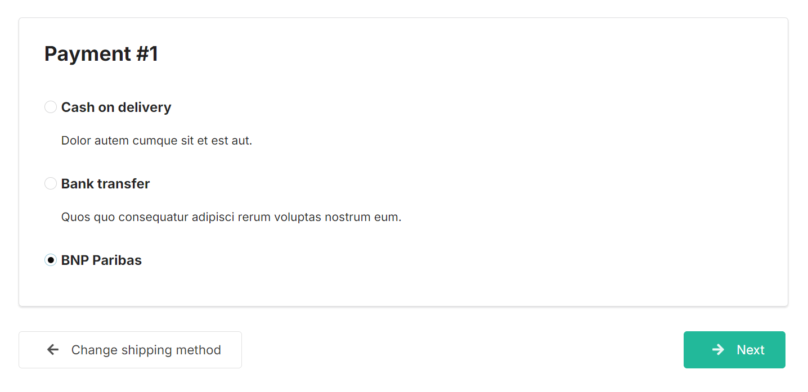

# Functionalities

---
## Introduction

---
BNP Paribas is an international banking group headquartered in Paris, France. It is one of the largest banks in Europe and operates worldwide.
The bank offers a wide range of financial services, including retail banking, corporate banking,
investment banking, as well as asset management and insurance.

This plugin supports communication with the BNP Paribas payment system API and allows payment in a lots of different ways.

    

More info:
https://documentation.mercanet.bnpparibas.net/en/payment-means-index.html

 

## Usage

---
### Adding Payment Gateway

After installation, users can add the payment method

    

 

...by completing the data received from the service provider.

    

 

### Use of the gateway

When ordering, you can now choose to pay by card:

    

 
